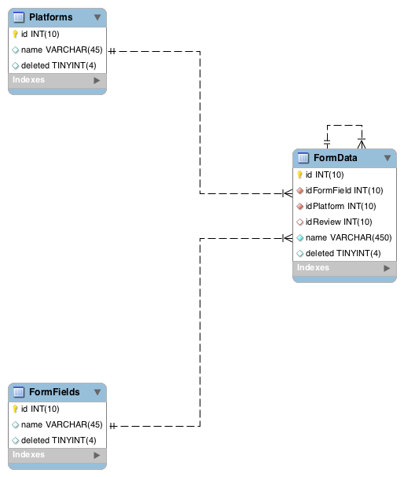

Database
========

Database Setup
--------------

Entity Relationship Diagram
---------------------------

Data JSON
---------

The JSON file containing the data contained within the database schema can be found :download:`here <src/data.json>`

The JSON above and the JSON served by the API is in the following format:

.. code-block:: json

  {
      "app_name": "App Name",
      "platforms":[
          "Platform 1",
          "Platform 2",
          "Platform n"
      ],
      "form_fields":[
          "form_field 1",
          "form_field 2",
          "form_field n-1",
          "form_field n"
      ],
      "Platform 1":{
          "id":{
              "form_field 1":"4",
              "form_field 2":"100"
          },
          "id 2":{
              "form_field 1":"4",
              "form_field 2":"100"
          }
      },
      "Platform 2":{
          "id":{
              "form_field 1":"4",
              "form_field 2":"100"
          },
          "id 2":{
              "form_field 1":"4",
              "form_field 2":"100"
          }
      }
  }

Test
